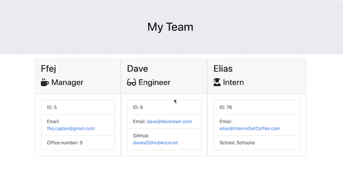

# Employee_Summary

## Figuring out the Assignment

It was tricky for me initially to figure out what this asignment was asking me to do. I think one of my hiccups is that in class we have already begun to build out some of the functionality that was provided. As such, I was kind of anticipating that I would be building out a lot more of the functionaltiy for this assignment than we ended up needing to build. Once, I figured out what was actually going on, things went a lot faster.

## Start with what you know

Inquirer is pretty easy for me. It's a lot like writing plain javascript, so I started with that. I was able to get a pretty basic build out of the prompts. However, I did end up having to go back and flesh it out as I got a better sense of what was going on.

## Embracing the confusion

My first thought was, why don't I just build this app all myself. But, when I started down that road, I realized that I still had a lot of backend to bone up on before I could get that done in the timeline provided. So I went back to the code provided and tried to sift through it so I could get a sense of what I was actually supposed to be doing. I think my big hiccup was forgetting about the functions you can add to a class. If I had remembered that earlier, this would have probably been easier for me to conceptualize. I was also a bit hung up on the the class functions. I was anticipating them to be so simple.

## Starting with Testing

Once I finally got around to building the classes, I realized that the testing code provided would be pretty handy. The code provided didn't quite fit the parameters needed to test the classes I was creating. The major issue was that they didn't have all the arguements.

Here's an example of what we were provided:

```
test("Can get GitHub username via getGithub()", () => {
  const testValue = "GitHubUser";
  const e = new Engineer("Foo", 1, "test@test.com", testValue);
  expect(e.getGithub()).toBe(testValue);
});
```

Now, when I ran this test against my class, it failed. The reason was that the `const e =` line didn't have all the arguments needed. So, I altered it to this

```
test("Can get GitHub username via getGithub()", () => {
  const testValue = "GitHubUser";
  const e = new Engineer("Foo", 1, "test@test.com", "Engineer", testValue);
  expect(e.getGithub()).toBe(testValue);
});
```

After applying these updates to all the tests where necessary, I not only had all the tests working, but I also had all of my classes built.

## Writing to HTML

This one confused me for a minute because I was considering the "main.html" file to be like an index.html file. So, I was trying to get the output/team.html file to append to the main.html file. But, once I remembered that the main.html was just a template, I tweaked my code so that the team.html file was the page that loaded when the server went live.
Using the code provdided made it pretty easy to write properly coded HTML to the team.html file.

## Some Final Tweaks

Once I had that finished, I just needed to go through my inquirer prompts to make sure that all the answers provided were the appropriate basic data types. I had to turn everything into functions so that I could call the prompts inside my if statements, but it worked out nicely. I could probably touch it up a bit, but I think it's pretty solid.

## And Here's the Final Product!

[](https://youtu.be/Aua6pFVTchg)
